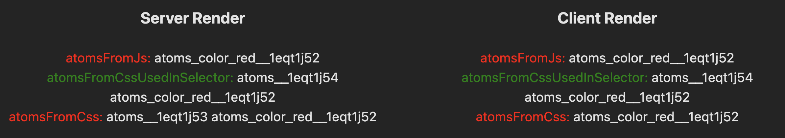
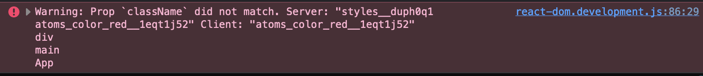

# Vanilla Extract with Atoms in Styles

A demonstration of a difference between Server and Client classes when not using `emitCssInSsr: true`, using [Vite] and [Sprinkles].

When creating a Sprinkles function inside a `css.ts` file, the resulting styles has an additional style on server-render that isn't always present on the server, resulting in a hydration error.

This only occurs when

- `emitCssInSsr` is not `true`
- A Sprinkles function be called in a `css.ts` file
- The resulting value must be exported, and NOT used in another selector

Related changes:

- Style Composition In Selectors - [PR #259](https://github.com/vanilla-extract-css/vanilla-extract/pull/259)
- Support passing arrays of styles to style and styleVariants - [PR #326](https://github.com/vanilla-extract-css/vanilla-extract/pull/326)

## Scenario

This project uses a fairly boilerplate solution created from following:

- [Create Vite](https://vitejs.dev/guide/)
- [Vite SSR Guide](https://vitejs.dev/guide/ssr.html)
- [Vanilla Extract Vite Plugin](https://vanilla-extract.style/documentation/integrations/vite/)

It then renders text on screen different times using different methods to apply CSS.

1. Calling the Atoms function at runtime. **Result:** No Additional class
2. Calling the Atoms function in `css.ts` and using it in Global Style. **Result:** Additional class on Server and Client
3. Calling the function in `css.ts` and only exporting. **Result:** Additional class on Server and NOT on Client.



The third method results in an hydration error as it renders a different result on the client and server.

```
Warning: Prop `className` did not match. Server: "atoms__1eqt1j53 atoms_color_red__1eqt1j52" Client: "atoms_color_red__1eqt1j52"
div
main
App
```



## To recreate

Ensure RECREATE_ERROR in `vite.config.ts` is `true`

```bash
pnpm install
pnpm dev
```

Navigate to the resulting URL. Typically [localhost:5173](http://localhost:5173).

Change RECREATE_ERROR to `false` and re-run to see error disappear.

[vite]: https://vitejs.dev
[sprinkles]: https://vanilla-extract.style/documentation/packages/sprinkles
