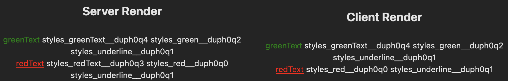

# Vanilla Extract Composed Styles

A demonstration of a difference between Server and Client classes when not using `emitCssInSsr: true`, using [Vite] and Server Side Rendering (SSR).

When creating a style composed of other styles, (either by passing an array to `style` or calling a Sprinkles function in a css file) Vanilla Extract will create an additional identifier class. If the class is unused, the class will appear in the server render, but will be stripped for the client render, resulting in a mismatch between renders known as a hydration error.

This only occurs when

- `emitCssInSsr` is not `true`
- A style is defined as a composition of other styles. (Or, a Sprinkles function called in a `css.ts` file)
- The resulting value must be exported, and NOT used in another selector

Though Sprinkles has been mentioned here, the demonstration below reveals this occurs without Sprinkles. It's just that your more likely to be in this scenario if you are using atomic styles.

Related changes:

- Style Composition In Selectors - [PR #259](https://github.com/vanilla-extract-css/vanilla-extract/pull/259)
- Support passing arrays of styles to style and styleVariants - [PR #326](https://github.com/vanilla-extract-css/vanilla-extract/pull/326)

## Scenario

This project uses a fairly boilerplate solution created from following:

- [Create Vite](https://vitejs.dev/guide/)
- [Vite SSR Guide](https://vitejs.dev/guide/ssr.html)
- [Vanilla Extract Vite Plugin](https://vanilla-extract.style/documentation/integrations/vite/)

It then renders text on screen different times using CSS generated by calling `style` with two existing styles in a `css.ts` file.

1. When the class has been used in a global style. **Result:** Additional class on Server and Client
2. When the class has NOT been used in a global style. **Result:** Additional class on Server and NOT on Client.



The second scenario results in an hydration error as it renders a different result on the client and server.

```
Warning: Prop `className` did not match. Server: "styles_redText__duph0q3 styles_red__duph0q0 styles_underline__duph0q1" Client: "styles_red__duph0q0 styles_underline__duph0q1"
span
div
main
App
```


## To recreate

Ensure RECREATE_ERROR in `vite.config.ts` is `true`

```bash
pnpm install
pnpm dev
```

Navigate to the resulting URL. Typically [localhost:5173](http://localhost:5173).

Change RECREATE_ERROR to `false` and re-run to see error disappear.

[vite]: https://vitejs.dev
[sprinkles]: https://vanilla-extract.style/documentation/packages/sprinkles
